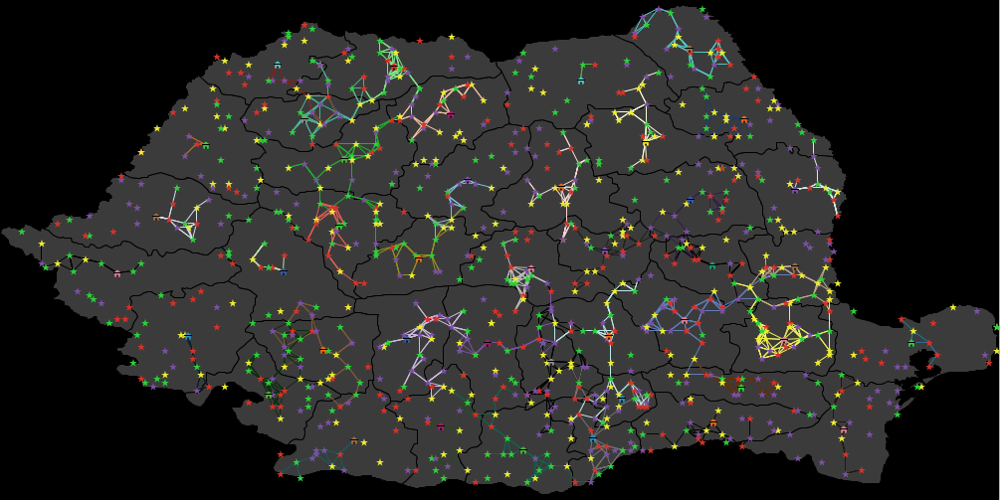
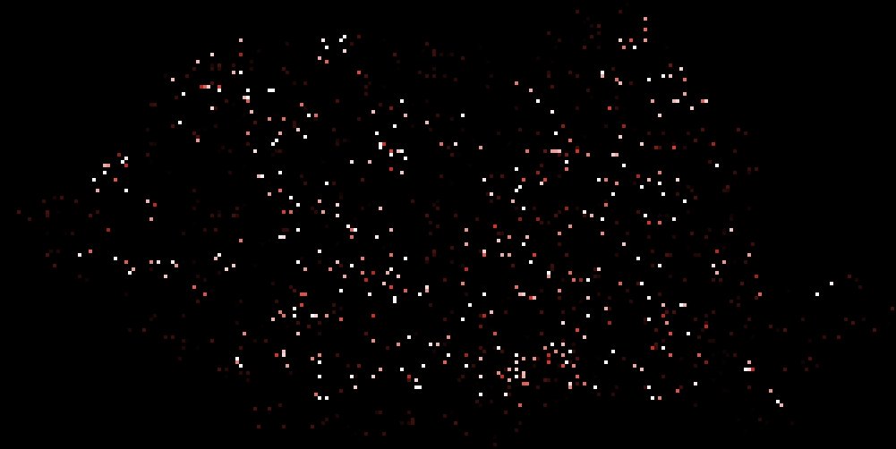

beedza
======

**Project beedza (name derived from the need of beer and pizza at the time of
conception) is developped during the french Complex System Summer School
happening at Le Havre, France from the 8th of july to the 18th of july.**

It is a team effort for developping a model featuring Multi-Agent System,
Multi-Level Modelling and Space Interactions.

It features how (honey) bee-keepers move from field to field to maximize their profit
while (honey) bees pollinate the very same fields in a separate dynamic.

Check out the presentation folder as well as the source code. All is written
with NetLogo and (possibly) Graphstream library.

